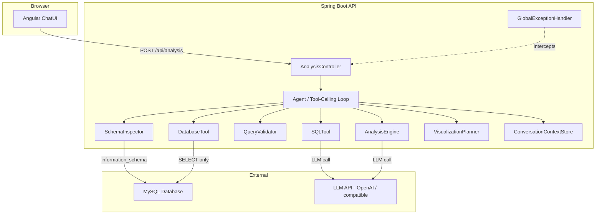
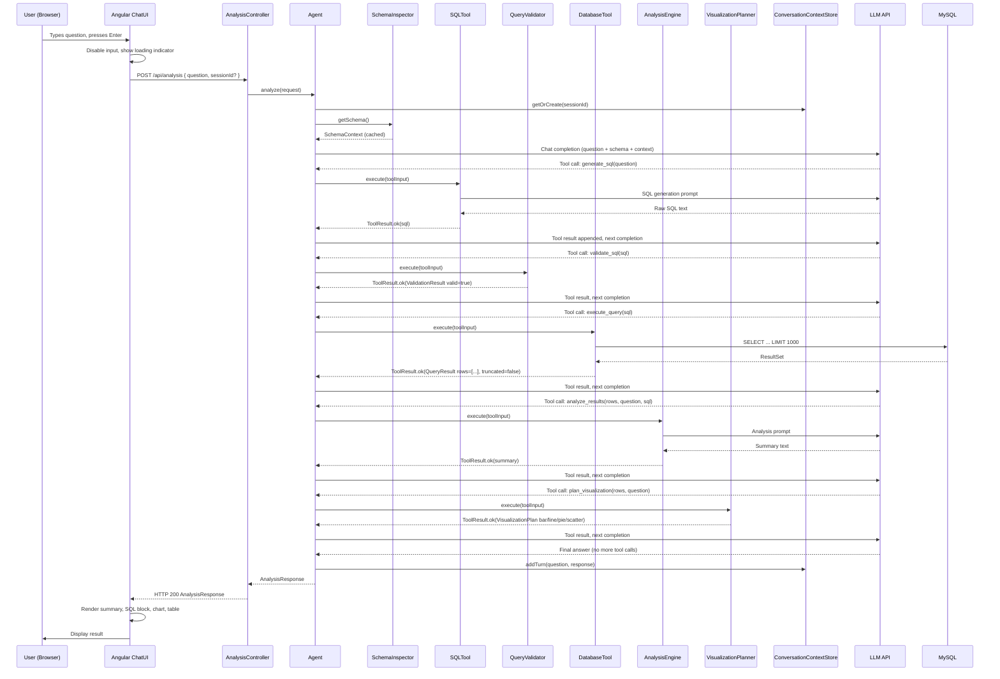
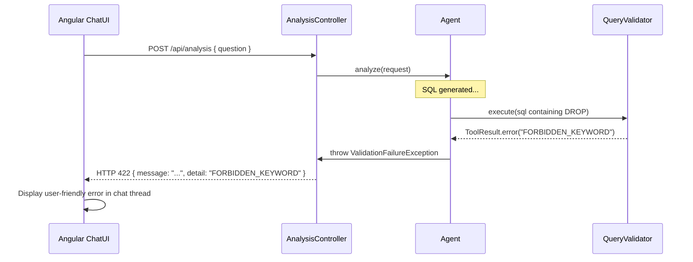
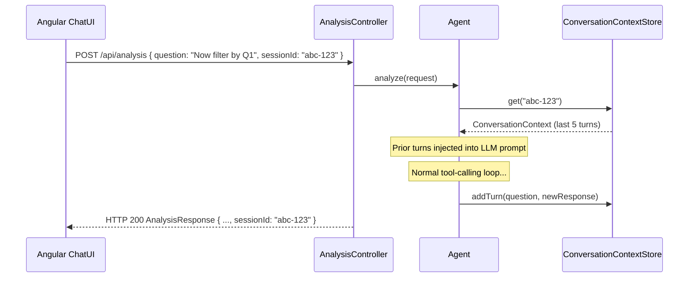

# Design Document — AI Data Analyst Agent

## Overview

The AI Data Analyst Agent is a production-style full-stack application that lets business users interrogate a MySQL database through plain-English questions. A user types a question in an Angular chat interface; the Spring Boot backend orchestrates an LLM-powered tool-calling loop that inspects the database schema, generates safe read-only SQL, executes the query, analyzes the results, selects a chart type, and returns a single structured `AnalysisResponse` JSON object. The frontend renders the summary, chart, data table, and syntax-highlighted SQL inside a chat thread.

The system is designed around five guiding principles:

1. **Safety first** — all generated SQL is validated before execution; a least-privilege database user prevents writes.
2. **Stateless backend, stateful session** — the Spring Boot API is horizontally scalable; conversation state lives in an in-memory map evicted after 30 minutes of inactivity.
3. **Extensible agent loop** — tools are registered by interface; adding new analysis tools does not require touching the orchestration loop.
4. **Secret hygiene** — the LLM API key is never in source code or responses; it is loaded from environment / externalized config at startup.
5. **Predictable contract** — the `AnalysisResponse` shape is fixed and fully documented so the Angular client can render deterministically.

---

## Architecture

### High-Level Component Diagram



### Deployment Topology

| Layer | Technology | Notes |
|-------|-----------|-------|
| Frontend | Angular 17+ SPA | Served by CDN or Nginx |
| Backend | Spring Boot 3.x (Java 21) | Stateless REST API; session state in-memory |
| Database | MySQL 8.x | Read-only analytics user for agent queries |
| LLM | OpenAI Chat Completions API (gpt-4o) or compatible | Accessed only from backend |
| Config | Environment variable / `application-secrets.yml` (gitignored) | Never committed |

---

## Components and Interfaces

### 1. AnalysisController

**Responsibility:** Accept HTTP requests, validate top-level input, delegate to the Agent, return structured responses.

```java
@RestController
@RequestMapping("/api")
public class AnalysisController {

    // POST /api/analysis
    // Request body: AnalysisRequest DTO
    // Returns: ResponseEntity<AnalysisResponse> or error body
    @PostMapping("/analysis")
    public ResponseEntity<?> analyze(@Valid @RequestBody AnalysisRequest request);
}
```

**Validation rules (Bean Validation):**
- `question` — `@NotBlank`, `@Size(max = 1000)`
- `sessionId` — `@Nullable` string

### 2. Agent (Tool-Calling Orchestration Loop)

**Responsibility:** Orchestrate the end-to-end pipeline. Maintain a registry of `AgentTool` implementations and invoke them in sequence, respecting the 10-tool-call limit.

```java
public interface AgentTool {
    String name();
    ToolResult execute(ToolInput input);
}
```

The loop pseudocode:

```
toolCallCount = 0
context = loadOrCreate(sessionId)
schema = schemaInspector.getSchema()
llmMessages = buildMessages(question, context, schema)

while toolCallCount < 10:
    llmResponse = llm.complete(llmMessages)
    if llmResponse.isToolCall():
        result = dispatchTool(llmResponse.toolName, llmResponse.toolArgs)
        llmMessages.append(toolResult(result))
        toolCallCount++
    else:
        return buildFinalResponse(llmResponse, accumulated steps)

// limit reached
return partialResponse(incomplete=true)
```

**Registered tools (initial set):**

| Tool Name | Class | Purpose |
|-----------|-------|---------|
| `generate_sql` | `SQLTool` | Generate SQL from natural language |
| `validate_sql` | `QueryValidator` | Enforce read-only security policy |
| `execute_query` | `DatabaseTool` | Run validated SQL via JDBC |
| `analyze_results` | `AnalysisEngine` | Generate business insight summary |
| `plan_visualization` | `VisualizationPlanner` | Choose chart type and axis config |

### 3. SchemaInspector

**Responsibility:** Load and cache the database schema at startup; serve it to the Agent on demand.

```java
@Service
public class SchemaInspector implements ApplicationListener<ApplicationReadyEvent> {

    // Populated at startup via information_schema
    private final Map<String, List<ColumnMetadata>> schemaCache;

    public SchemaContext getSchema(); // throws SchemaUnavailableException if cache empty

    @Override
    public void onApplicationEvent(ApplicationReadyEvent event);
    // Logs ERROR + marks system unhealthy if DB unreachable
}

public record ColumnMetadata(String columnName, String dataType) {}

public record SchemaContext(Map<String, List<ColumnMetadata>> tables) {
    public String toPromptString(); // formats as CREATE TABLE-style DDL for LLM prompt
}
```

Targets tables: `customers`, `products`, `orders` (requirement 2.7).

### 4. SQLTool (implements AgentTool)

**Responsibility:** Use the LLM to convert user intent + schema context into a raw SQL string.

Key behaviors:
- Strips markdown fences (` ```sql ... ``` `) and prose from LLM output (requirement 3.3).
- Detects `revenue`/`profit` keywords (case-insensitive) and injects metric derivation instructions into the prompt (requirement 3.6).
- Returns `ToolResult.error("SQL_GENERATION_FAILED")` if no SELECT is extractable (requirement 3.4).
- Returns `ToolResult.error("UNSAFE_SQL_GENERATED")` if extracted statement does not start with `SELECT` (requirement 3.5).

```java
@Service
public class SQLTool implements AgentTool {
    public ToolResult execute(ToolInput input); // input contains question + schema
    private String extractSql(String llmOutput);
    private String buildSqlPrompt(String question, SchemaContext schema, boolean hasRevenue, boolean hasProfit);
}
```

### 5. QueryValidator (implements AgentTool)

**Responsibility:** Perform static analysis on a SQL string to enforce the read-only policy before any execution.

Validation sequence (short-circuit on first failure):

| Order | Check | Failure Reason |
|-------|-------|---------------|
| 1 | Input is null or blank | `EMPTY_STATEMENT` |
| 2 | Trimmed statement starts with `SELECT` (case-insensitive) | `MISSING_SELECT_KEYWORD` |
| 3 | No forbidden DML/DDL keywords as whole tokens | `FORBIDDEN_KEYWORD` |
| 4 | No `;` followed by non-whitespace | `MULTIPLE_STATEMENTS` |
| 5 | No `--` or `/*` | `SQL_COMMENT_DETECTED` |

```java
@Service
public class QueryValidator implements AgentTool {
    public ValidationResult validate(String sql);
    public ToolResult execute(ToolInput input); // wraps validate()
}

public record ValidationResult(boolean valid, String reason, String matchedKeyword) {}
```

Forbidden keywords (whole-token, case-insensitive): `INSERT`, `UPDATE`, `DELETE`, `DROP`, `ALTER`, `TRUNCATE`, `CREATE`, `RENAME`, `GRANT`, `REVOKE`.

### 6. DatabaseTool (implements AgentTool)

**Responsibility:** Execute validated SQL against MySQL using JDBC and return a row-list result.

```java
@Service
public class DatabaseTool implements AgentTool {
    // Uses a restricted DataSource (SELECT-only MySQL user)
    public QueryResult execute(String sql); // appends LIMIT 1000 before execution
    public ToolResult execute(ToolInput input); // AgentTool implementation
}

public record QueryResult(
    List<Map<String, Object>> rows,
    boolean truncated,
    String error         // null on success
) {}
```

- `LIMIT 1000` is appended unconditionally (requirement 5.4).
- `QueryTimeout` set to 30 s via `Statement.setQueryTimeout(30)` (requirement 5.2).
- On timeout: returns `error = "QUERY_TIMEOUT"` (requirement 5.3).
- On other errors: logs at ERROR level with offending SQL, returns sanitized `error = "QUERY_EXECUTION_ERROR"` (requirement 5.5).

### 7. AnalysisEngine (implements AgentTool)

**Responsibility:** Send result data + original question to the LLM and produce a ≤ 3-sentence business summary.

```java
@Service
public class AnalysisEngine implements AgentTool {
    public String analyze(List<Map<String, Object>> rows, String question, String sql);
    public ToolResult execute(ToolInput input);
}
```

Key behaviors:
- Empty result set → returns fixed string `"No data was found matching your query criteria."` without LLM call (requirement 6.3).
- LLM prompt instructs inclusion of at least one numeric metric when numeric columns are present (requirement 6.4).
- Summary must not contain SQL text, column/table names as-is, or stack traces (requirement 6.5).
- LLM timeout (30 s) → throws `AnalysisServiceException` → caught by `GlobalExceptionHandler` → HTTP 503 (requirement 6.6).

### 8. VisualizationPlanner (implements AgentTool)

**Responsibility:** Inspect result set metadata and apply priority rules to choose chart type and axis columns.

```java
@Service
public class VisualizationPlanner implements AgentTool {
    public VisualizationPlan plan(List<Map<String, Object>> rows, String question);
    public ToolResult execute(ToolInput input);
}

public record VisualizationPlan(
    String chartType,   // "bar" | "line" | "pie" | "scatter"
    String xAxis,
    String yAxis
) {}
```

Rule evaluation order (highest priority first):

| Priority | Rule | Chart Type |
|----------|------|-----------|
| 1 (highest) | Time-dimension column + numeric column | `line` |
| 2 | Exactly 2 numeric columns, no time dimension | `scatter` |
| 3 | 1 categorical + 1 numeric column, 2–6 rows | `pie` |
| 4 | ≥1 categorical + ≥1 numeric, no higher rule matches | `bar` |
| default | No rule matches | `bar` |

Time-dimension detection: column name contains `month`, `year`, `quarter`, or SQL type is `DATE`/`DATETIME`.

If x-axis or y-axis cannot be resolved → `ToolResult.error("AXIS_RESOLUTION_FAILED")`.

### 9. ConversationContextStore

**Responsibility:** Maintain per-session conversation history in memory with TTL-based eviction.

```java
@Service
public class ConversationContextStore {
    // ConcurrentHashMap<sessionId, ConversationContext>
    // Scheduled cleanup every 1 minute; evicts sessions idle > 30 min

    public ConversationContext getOrCreate(String sessionId);
    public ConversationContext get(String sessionId); // throws SessionNotFoundException if absent
    public void save(String sessionId, ConversationContext context);

    @Scheduled(fixedDelay = 60_000)
    void evictExpiredSessions();
}

public class ConversationContext {
    private final Deque<TurnPair> turns; // max capacity 5, evicts oldest on overflow
    private Instant lastActivityTime;

    public void addTurn(String question, AnalysisResponse response);
    public List<TurnPair> getRecentTurns(int max); // returns up to 5 most recent

    public record TurnPair(String question, String summary, String sql) {}
}
```

- New `sessionId` when not provided: `UUID.randomUUID().toString()` (requirement 9.4).
- Unknown `sessionId`: HTTP 400 `"Session not found or has expired."` (requirement 9.3).
- Up to 5 turns passed to LLM context (requirement 9.6).

### 10. GlobalExceptionHandler

**Responsibility:** Map all unhandled exceptions to safe, consistent JSON error responses.

```java
@RestControllerAdvice
public class GlobalExceptionHandler {

    @ExceptionHandler(MethodArgumentNotValidException.class)
    ResponseEntity<ErrorResponse> handleValidation(...); // HTTP 400

    @ExceptionHandler(SessionNotFoundException.class)
    ResponseEntity<ErrorResponse> handleSession(...); // HTTP 400

    @ExceptionHandler(SqlGenerationException.class)
    ResponseEntity<ErrorResponse> handleSqlGeneration(...); // HTTP 422

    @ExceptionHandler(ValidationFailureException.class)
    ResponseEntity<ErrorResponse> handleValidationFailure(...); // HTTP 422

    @ExceptionHandler(LlmUnavailableException.class)
    ResponseEntity<ErrorResponse> handleLlmUnavailable(...); // HTTP 503

    @ExceptionHandler(DatabaseUnavailableException.class)
    ResponseEntity<ErrorResponse> handleDbUnavailable(...); // HTTP 503

    @ExceptionHandler(Exception.class)
    ResponseEntity<ErrorResponse> handleUnexpected(...); // HTTP 500 + UUID errorId + ERROR log
}
```

All handlers produce `ErrorResponse` with `message` and optional `detail` / `errorId`. No stack traces or raw exception messages in the body (requirement 14.4).

### 11. Angular ChatUI

**Responsibility:** Render the conversation thread, accept user input, submit questions to the API, and display results.

Key Angular components:

| Component | Responsibility |
|-----------|---------------|
| `AppComponent` | Root shell with sidebar navigation |
| `ChatComponent` | Conversation thread container |
| `MessageComponent` | Single AI response bubble (summary + SQL + chart + table) |
| `QuestionInputComponent` | Input box + send button; disables during in-flight requests |
| `ChartComponent` | Wraps `Chart.js` canvas; switches chart type based on `chartType` field |
| `DataTableComponent` | Renders ≤50 rows with comma-formatted numbers |
| `SqlViewerComponent` | Syntax-highlighted SQL code block (using `highlight.js` or `ngx-highlightjs`) |

**Services:**
- `AnalysisService` — HTTP client wrapper for `POST /api/analysis`; manages `sessionId` in component state.
- `SessionService` — Holds current `sessionId` across the chat session.

---

## Data Models

### API Request / Response DTOs

```java
// Request
public record AnalysisRequest(
    @NotBlank @Size(max = 1000) String question,
    @Nullable String sessionId
) {}

// Success response
public record AnalysisResponse(
    String question,
    String sql,
    String chartType,        // "bar" | "line" | "pie" | "scatter"
    String xAxis,
    String yAxis,
    List<Map<String, Object>> data,   // max 1000 entries
    String summary,
    String sessionId,
    List<StepResult> steps,          // nullable; multi-step analysis
    Boolean incomplete               // null or false normally; true if tool-call limit hit
) {}

// Multi-step intermediate result
public record StepResult(
    String sql,
    List<Map<String, Object>> data
) {}

// Error response
public record ErrorResponse(
    String message,
    String detail,     // optional — omitted when null
    String errorId     // optional — present only on HTTP 500
) {}
```

### Internal Domain Objects

```java
// Schema
public record ColumnMetadata(String columnName, String dataType) {}
public record SchemaContext(Map<String, List<ColumnMetadata>> tables) {}

// Tool communication
public record ToolInput(Map<String, Object> params) {}
public record ToolResult(boolean success, Object payload, String errorReason) {
    public static ToolResult ok(Object payload) { ... }
    public static ToolResult error(String reason) { ... }
}

// Validation
public record ValidationResult(boolean valid, String reason, String matchedKeyword) {}

// Query execution
public record QueryResult(List<Map<String, Object>> rows, boolean truncated, String error) {}

// Visualization
public record VisualizationPlan(String chartType, String xAxis, String yAxis) {}

// Conversation
public record TurnPair(String question, String summary, String sql) {}
```

### MySQL Database Schema (Analytics Tables)

```sql
-- customers
CREATE TABLE customers (
    customer_id   INT PRIMARY KEY,
    customer_name VARCHAR(255),
    city          VARCHAR(100),
    segment       VARCHAR(100)  -- e.g., Consumer, Corporate, Home Office
);

-- products
CREATE TABLE products (
    product_id   INT PRIMARY KEY,
    product_name VARCHAR(255),
    category     VARCHAR(100),
    cost_price   DECIMAL(10,2),
    unit_price   DECIMAL(10,2)
);

-- orders
CREATE TABLE orders (
    order_id    INT PRIMARY KEY,
    customer_id INT,
    product_id  INT,
    order_date  DATE,
    quantity    INT,
    FOREIGN KEY (customer_id) REFERENCES customers(customer_id),
    FOREIGN KEY (product_id)  REFERENCES products(product_id)
);
```

Revenue = `quantity * unit_price`  
Profit = `(quantity * unit_price) - (quantity * cost_price)`

### Angular TypeScript Interfaces

```typescript
interface AnalysisRequest {
  question: string;
  sessionId?: string;
}

interface AnalysisResponse {
  question: string;
  sql: string;
  chartType: 'bar' | 'line' | 'pie' | 'scatter';
  xAxis: string;
  yAxis: string;
  data: Record<string, unknown>[];
  summary: string;
  sessionId: string;
  steps?: StepResult[];
  incomplete?: boolean;
}

interface StepResult {
  sql: string;
  data: Record<string, unknown>[];
}

interface ErrorResponse {
  message: string;
  detail?: string;
  errorId?: string;
}
```

---

## API Contract

### POST /api/analysis

**Request:**

```
POST /api/analysis
Content-Type: application/json

{
  "question": "What are the top 5 products by revenue?",
  "sessionId": "550e8400-e29b-41d4-a716-446655440000"  // optional
}
```

**Responses:**

| Status | Condition | Body |
|--------|-----------|------|
| 200 | Success | `AnalysisResponse` |
| 400 | Empty/whitespace question | `ErrorResponse { message: "Question must not be empty." }` |
| 400 | Question > 1000 chars | `ErrorResponse { message: "Question exceeds the 1000 character limit." }` |
| 400 | Unknown/expired sessionId | `ErrorResponse { message: "Session not found or has expired." }` |
| 422 | SQL generation failed | `ErrorResponse { message: "The question could not be translated to a query.", detail: "SQL_GENERATION_FAILED" }` |
| 422 | SQL validation failed | `ErrorResponse { message: "Generated SQL failed security validation.", detail: "<reason>" }` |
| 422 | Axis resolution failed | `ErrorResponse { message: "Could not determine chart axes from result.", detail: "AXIS_RESOLUTION_FAILED" }` |
| 503 | LLM unavailable | `ErrorResponse { message: "AI service is temporarily unavailable." }` |
| 503 | DB unavailable | `ErrorResponse { message: "Database service is temporarily unavailable." }` |
| 500 | Unexpected error | `ErrorResponse { message: "An unexpected error occurred.", errorId: "<UUID>" }` |

**Content-Type:** `application/json` on all responses.

**CORS:** Origins matching the Angular dev server (`http://localhost:4200`) and production domain must be explicitly allowed.

---

## Sequence Flows

### Happy Path — Single-Turn Question



### Validation Failure Path



### Session Follow-Up Path



---

## Error Handling

### Error Classification and Response Mapping

| Exception Class | HTTP Status | `message` | `errorId` |
|----------------|-------------|-----------|-----------|
| `MethodArgumentNotValidException` | 400 | Field-level validation message | — |
| `SessionNotFoundException` | 400 | `"Session not found or has expired."` | — |
| `SqlGenerationException` | 422 | `"The question could not be translated to a query."` | — |
| `ValidationFailureException` | 422 | `"Generated SQL failed security validation."` | — |
| `AxisResolutionException` | 422 | `"Could not determine chart axes from result."` | — |
| `LlmUnavailableException` | 503 | `"AI service is temporarily unavailable."` | — |
| `DatabaseUnavailableException` | 503 | `"Database service is temporarily unavailable."` | — |
| `SchemaUnavailableException` | 503 | `"Schema service is temporarily unavailable."` | — |
| `Exception` (catch-all) | 500 | `"An unexpected error occurred."` | UUID (logged + returned) |

### Key Error Handling Rules

- **No raw exception messages** in any response body (requirement 14.4).
- **Full stack traces** are logged at ERROR level with correlation UUID (requirement 14.3).
- **LLM timeouts** (30 s) in SQLTool, AnalysisEngine → `LlmUnavailableException` → HTTP 503.
- **Query timeout** (30 s) in DatabaseTool → `ToolResult.error("QUERY_TIMEOUT")` → Agent surfaces as HTTP 503.
- **Schema load failure** at startup → ERROR log + `SchemaUnavailableException` on every request until repopulated.
- **Tool-call limit** reached → HTTP 200 with `incomplete: true` (requirement 15.5), not an error.
- **LLM API key absent** at startup → application fails to start + ERROR log (requirement 13.8).

### Angular Error Handling

- HTTP interceptor catches non-2xx responses and transforms them into user-friendly messages.
- Error messages displayed within the conversation thread bubble, never as alert dialogs.
- No raw JSON, SQL, or stack traces rendered in the UI (requirement 10.7).

---

## Testing Strategy

### Backend — Unit Tests (Spring Boot / JUnit 5 + Mockito)

Focus on concrete scenarios and edge cases for each service:

- `QueryValidator`: each rejection reason, SELECT pass-through, null/empty input.
- `SQLTool`: SQL extraction from markdown-fenced LLM output, revenue/profit keyword injection, non-SELECT detection.
- `DatabaseTool`: timeout handling, LIMIT 1000 appending, truncated flag, error sanitization.
- `AnalysisEngine`: empty result set fixed string, LLM timeout behavior.
- `VisualizationPlanner`: each chart-type rule in priority order, default bar fallback, axis resolution failure.
- `ConversationContextStore`: TTL eviction, max-5-turn capping, unknown session exception.
- `GlobalExceptionHandler`: each exception type → correct HTTP status and body shape.

### Backend — Property-Based Tests (see Correctness Properties section)

Use **jqwik** (Java property-based testing library) with minimum **100 tries** per property.

### Frontend — Unit Tests (Jest + Angular Testing Library)

- `ChartComponent`: correct chart type rendered per `chartType` value, unsupported type message.
- `DataTableComponent`: ≤50 row limit, "Showing N of M rows" message, number formatting.
- `QuestionInputComponent`: disabled state during in-flight request, Enter-key submission.
- `AnalysisService`: HTTP client request shape, `sessionId` propagation.

### Frontend — Property-Based Tests (fast-check)

Use **fast-check** for frontend properties with minimum **100 tries** per property.

### Integration Tests

- Full-stack smoke test: mock LLM + real MySQL (Testcontainers) → POST `/api/analysis` → HTTP 200.
- Schema load on startup with Testcontainers MySQL.
- CORS header validation.

### Test Configuration

Each property test must be tagged with:
```
// Feature: ai-data-analyst-agent, Property N: <property text>
```

---

## Correctness Properties

*A property is a characteristic or behavior that should hold true across all valid executions of a system — essentially, a formal statement about what the system should do. Properties serve as the bridge between human-readable specifications and machine-verifiable correctness guarantees.*

The properties below were derived from a systematic review of all acceptance criteria. Each property is universally quantified ("for any" or "for all") and is suitable for property-based testing using **jqwik** (backend / Java) and **fast-check** (frontend / TypeScript) with a minimum of **100 iterations** each.

---

### Property 1: Question length boundary enforcement

*For any* string submitted as a question, the API SHALL accept it (HTTP 200) if and only if its trimmed length is between 1 and 1000 characters inclusive; any trimmed-empty or over-1000-character input SHALL produce HTTP 400.

**Validates: Requirements 1.1, 1.3, 1.4**

---

### Property 2: Whitespace-only questions are rejected

*For any* string composed entirely of whitespace characters (space, tab, newline, carriage return, or any combination), submitting it as a question SHALL produce HTTP 400 with an error message that explicitly states the input was empty.

**Validates: Requirements 1.3**

---

### Property 3: SQL markdown extraction round-trip

*For any* valid SQL SELECT statement, wrapping it in arbitrary markdown code fences (with or without language hint), leading prose, trailing prose, or excess whitespace, and then passing that text through the SQLTool's extraction logic SHALL yield the original SQL string (modulo leading/trailing whitespace trimming).

**Validates: Requirements 3.3**

---

### Property 4: Non-SELECT inputs are rejected as unsafe

*For any* SQL string whose first non-whitespace keyword is not `SELECT` (e.g., strings beginning with INSERT, UPDATE, DELETE, DROP, ALTER, TRUNCATE, CREATE, or any other DML/DDL keyword), the SQLTool SHALL return a ToolResult with `errorReason = "UNSAFE_SQL_GENERATED"` and SHALL NOT pass the statement to the QueryValidator or DatabaseTool.

**Validates: Requirements 3.5**

---

### Property 5: QueryValidator accepts well-formed SELECT statements

*For any* SQL string that begins with `SELECT` (case-insensitive, leading whitespace ignored), contains no forbidden keywords as whole tokens, no multi-statement semicolons, and no comment sequences, the QueryValidator SHALL return `ValidationResult(valid=true)`.

**Validates: Requirements 4.1, 4.7**

---

### Property 6: QueryValidator rejects non-SELECT statements

*For any* SQL string whose first non-whitespace token is not `SELECT` (case-insensitive), the QueryValidator SHALL return `ValidationResult(valid=false, reason="MISSING_SELECT_KEYWORD")`.

**Validates: Requirements 4.1, 4.2**

---

### Property 7: QueryValidator rejects forbidden DML/DDL keywords

*For any* SQL string that contains any of the forbidden keywords (`INSERT`, `UPDATE`, `DELETE`, `DROP`, `ALTER`, `TRUNCATE`, `CREATE`, `RENAME`, `GRANT`, `REVOKE`) as whole word tokens (case-insensitive), even when the statement begins with `SELECT`, the QueryValidator SHALL return `ValidationResult(valid=false, reason="FORBIDDEN_KEYWORD")` with the matched keyword populated.

**Validates: Requirements 4.3**

---

### Property 8: QueryValidator rejects multi-statement SQL

*For any* SQL string containing the sequence of a semicolon followed by one or more non-whitespace characters, the QueryValidator SHALL return `ValidationResult(valid=false, reason="MULTIPLE_STATEMENTS")`.

**Validates: Requirements 4.4**

---

### Property 9: QueryValidator rejects SQL with comment sequences

*For any* SQL string containing `--` or `/*` at any position, the QueryValidator SHALL return `ValidationResult(valid=false, reason="SQL_COMMENT_DETECTED")`.

**Validates: Requirements 4.5**

---

### Property 10: DatabaseTool always appends LIMIT 1000

*For any* valid SQL string passed to the DatabaseTool, the SQL string actually submitted to JDBC for execution SHALL end with `LIMIT 1000` (case-insensitive), regardless of the original query structure.

**Validates: Requirements 5.4**

---

### Property 11: DatabaseTool result set columns are fully preserved

*For any* JDBC result set with N columns and M rows, the `QueryResult` returned by the DatabaseTool SHALL contain a list of M `Map<String, Object>` entries where each map has exactly N keys matching the column names from the result set metadata, and each value matches the corresponding cell value.

**Validates: Requirements 5.6**

---

### Property 12: AnalysisEngine summary length constraint

*For any* non-empty result set and any user question, the summary string returned by the AnalysisEngine SHALL contain no more than 3 sentences (where a sentence is delimited by a period, exclamation mark, or question mark followed by whitespace or end-of-string).

**Validates: Requirements 6.2**

---

### Property 13: VisualizationPlanner always returns a valid chart type

*For any* non-empty result set, the VisualizationPlanner SHALL return a `VisualizationPlan` whose `chartType` field is exactly one of the string values `"bar"`, `"line"`, `"pie"`, or `"scatter"`.

**Validates: Requirements 7.1**

---

### Property 14: Time-dimension result sets produce line charts

*For any* result set that contains at least one column whose name contains `month`, `year`, or `quarter` (case-insensitive), or whose SQL type is `DATE` or `DATETIME`, and at least one numeric column, the VisualizationPlanner SHALL return `chartType = "line"`.

**Validates: Requirements 7.3**

---

### Property 15: Dual-numeric result sets produce scatter charts

*For any* result set that contains exactly two numeric columns and no time-dimension column, the VisualizationPlanner SHALL return `chartType = "scatter"`.

**Validates: Requirements 7.4**

---

### Property 16: Small categorical-numeric result sets produce pie charts

*For any* result set that contains exactly one categorical column and exactly one numeric column, and whose row count is between 2 and 6 inclusive (and no time-dimension column and not exactly 2 numerics), the VisualizationPlanner SHALL return `chartType = "pie"`.

**Validates: Requirements 7.5**

---

### Property 17: VisualizationPlanner axis columns are valid result set keys

*For any* result set that produces a successful `VisualizationPlan` (i.e., no `AXIS_RESOLUTION_FAILED` error), the `xAxis` and `yAxis` string values in the plan SHALL both be present as column names in the result set metadata.

**Validates: Requirements 7.7**

---

### Property 18: AnalysisResponse always contains all required fields

*For any* successful analysis request, the returned `AnalysisResponse` JSON object SHALL contain non-null values for all required fields: `question`, `sql`, `chartType`, `xAxis`, `yAxis`, `data`, `summary`, and `sessionId`.

**Validates: Requirements 8.1, 9.8**

---

### Property 19: No sensitive data in any API response body

*For any* API response (success or error, any HTTP status), the serialized response body SHALL not contain the LLM API key string, raw database connection strings, Java exception class names, or stack trace line patterns (e.g., strings matching `at com.` or `Caused by:`).

**Validates: Requirements 8.7, 13.3, 14.4**

---

### Property 20: New requests without sessionId always receive a valid UUID

*For any* valid analysis request that omits the `sessionId` field, the `AnalysisResponse.sessionId` SHALL be a string that conforms to the UUID v4 format (`xxxxxxxx-xxxx-4xxx-yxxx-xxxxxxxxxxxx`).

**Validates: Requirements 9.4**

---

### Property 21: LLM prompt includes at most 5 conversation turns

*For any* `ConversationContext` containing N prior turns (where N can be any non-negative integer), the LLM prompt constructed by the Agent SHALL include at most `min(N, 5)` prior turn entries.

**Validates: Requirements 9.6**

---

### Property 22: Agent tool-call loop never exceeds 10 invocations

*For any* user question where the LLM continuously requests additional tool calls, the Agent SHALL halt the loop after at most 10 tool invocations per request and SHALL NOT make an 11th tool call.

**Validates: Requirements 15.4**

---

### Property 23: Multi-step analysis steps field is consistent with executed queries

*For any* analysis that results in N tool executions (1 ≤ N ≤ 10), the `AnalysisResponse.steps` array SHALL contain exactly N entries, each with a non-null `sql` string and a non-null `data` array matching the result of that step's query execution.

**Validates: Requirements 15.3**

---

### Property 24: Chart axis labels match AnalysisResponse axis fields

*For any* `AnalysisResponse` with non-null `xAxis` and `yAxis` strings and non-empty `data`, the rendered chart canvas SHALL display axis labels whose text content exactly matches the `xAxis` and `yAxis` field values.

**Validates: Requirements 11.6**

---

### Property 25: Unsupported chart types always show fallback message

*For any* string value assigned to `chartType` that is not one of `"bar"`, `"line"`, `"pie"`, or `"scatter"`, the `ChartComponent` SHALL display the text `"Chart type not supported"` and SHALL NOT attempt to render a chart canvas.

**Validates: Requirements 11.8**

---

### Property 26: Data table renders at most 50 rows with correct count message

*For any* `data` array of length N passed to the `DataTableComponent`:
- The table SHALL render exactly `min(N, 50)` data rows.
- If N > 50, the component SHALL display the message `"Showing 50 of N rows"` with the correct value of N.
- If N ≤ 50, no truncation message is shown.

**Validates: Requirements 12.3, 12.4**

---

### Property 27: Data table column headers match data object keys

*For any* `AnalysisResponse` with a non-empty `data` array, the column headers rendered by the `DataTableComponent` SHALL be exactly the keys of `data[0]`, preserving their original order.

**Validates: Requirements 12.2**

---

### Property 28: Numeric values are correctly formatted with thousand separators

*For any* integer value N displayed in a data table cell, the rendered string SHALL use thousand-separator commas (e.g., 1250000 → "1,250,000"). For any decimal value D, the rendered string SHALL use thousand-separator commas and display exactly two decimal places (e.g., 12500.5 → "12,500.50").

**Validates: Requirements 12.5, 12.6**

